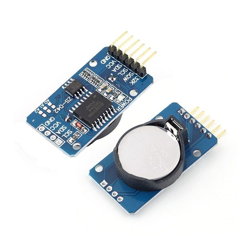

# Meteo Station

### Team members

* Matej Ledvina (221339)
* Tomáš Marčák (221040)
* Pavol Rohaľ (221066)
* Matyáš Sedláček (221069)

Link to this file in your GitHub repository:

[TBD](https://github.com/...)

### Table of contents

* [Project objectives](#objectives)
* [Hardware description](#hardware)
* [Libraries description](#libs)
* [Main application](#main)
* [Video and *.hex file](#video)
* [References](#references)

<a name="objectives"></a>

## Project objectives

The main objective of this project is to create a solar powered weather station with 2-axis solar tracking system. 
We decided to measure temperature, humidity and pressure. We also decided to use light intensity sensors and panel positioning servo motors.
Therefore the application has to be able to: 
* Read data form sensors and convert them to meaningful values
* Track time and give the user the ability to change the set time 
* Detect light levels and according to them adjust the panel position (via servo motors)
* Display the measured values on the LCD and send them through serial communication using UART protocol 

<a name="hardware"></a>

## Hardware description

### Arduino UNO / ATmega328P 

   
   
The project uses the Arduino UNO board with the ATmega328P microcontroller at its core. 
The ATmega328P is an 8-bit AVR RISC-based microcontroller with a 32kB flash memory and has read and write capabilities.
The UNO board is an open source development board with 14 digital pins, 6 analog pins and it can be powered with voltages from 7 to 20 Volts and can provide either 3.3V or 5V.
Below is a link for ATmega328P datasheet. 

Link to documentation: [Datasheet](Datasheets/atmega328p.pdf)

### LCD Hd44780

In this project the HD44780 operates in 4-bit mode. Although it is slower than the 8-bit mode, it occupies less pins on the UNO board and therfore it is more appropiate for our purposes. It is a 16x2 LCD (Liquid Crystal Display). It has the ability to store custom symbols in its volatile memory, which will be used. 

   
   
### DHT12 - Temperature and humidity sensor

   

The DHT12 is a temperature and humidity sensor, powered by a voltage of 5V. This sensor was chosen for its relative simplicity in how it stores data, low cost and the ability to communicate via the I2C protocol. Only the humidity readings are used in this project, and at that, only the whole part of humidity. The reason is that, even though humidity readings from the DHT12 have the resolution of 0.1%, the sensor has the precision of only +-5% (at 60% relative humidity), as stated by the manufacturer. The value range for relative humidity readings is from 20 to 95 %, which is quite enough for most situations in the temperate climate of the Czech republic (although 100% relative humidity, basically fog, is not unrealistic). Combined with the above mentioned reading precision, it is appropriate for giving a general idea of the current relative humidity levels. As mentioned above, only a single register is being read out via the I2C protocol, initiated with the DHT12's address (0x5C) and then a read request for the register storing the whole part of the relative humidity reading (0x00).

Link to documentation: [Datasheet](Datasheets/DHT12.pdf)

### HP206C - Pressure and temperature sensor

   

The HP206C is a pressure and temperature sensor, powered by a voltage of 3.3V.This sensor was chosen, similarily to the DHT12, for the relative simplicity of getting meaningful values out of it and its I2C capability. It's device adress is 0x76 (The 0xEC(8bit) value as told by the manufacturer is wrong, since it is outside of I2C value range, the 0x76(7bit) which actually works is just ). We use both the temperature and pressure readings which are stored as signed and unsigned 20-bit integers and are already compensated by the sensor itself. The range for temperature is from -40°C to 85°C with the accuracy within the whole range being +-1°C, which suffices for our purposes, as we will be rounding the values to be integers. The temperature is stored as a signed 20-bit value in three 8-bit registers, the reading of which is initiated from adress (0x32). After a division by 100, it is in degrees Celsius. The range for pressure is from 300 to 1200 hPa with an accuracy within +-3 hPa. The pressure is stored as a 20-bit unsigned integer, the reading of which is initiated from adress (0x30). After a division by 100, the data is in units hPa.

Note: *The original project contained a BME280 sensor, which can do the job of both of the used sensors at once and is available for testing in the DE2 laboratory. But since the values it stores are uncompensated, there would be a need to read out the compensation constants as well as the data itself and then do the appropriate conversions. This is quite complicated and the manufacturer (Bosch) advises to use their own library for correct operation. However, since the usage of own libraries (or the ones used during lessons) is encouraged by the assignement, after a group consideration of pros and cons, we have opted to use the above described sensor, for which, the complexity of creating a library is by some measure reduced.*

Link to documentation: [Datasheet](Datasheets/hp206c.pdf)

### DS3231 - RTC module

   
   
The RTC (Real Time Clock) module used is the DS3231. The purpose of the RTC module is to provide accurate time for the entire station. The module contains a battery which keeps the RTC powered even if the power is lost. Time data from the RTC is sent to the microcontroller via the I2C bus in the READ state of the interrupt service routine, and is displayed on the LCD and sent through UART for data logging. The RTC also provides the station with a 1Hz pulse which triggers a hardware interrupt for reading and displaying data. The DS3231 was chosen because it is widely available and appropriately priced for its precision. Also it stores the time values inside its registeres in an easy to extract format. 

Link to documentation: [Datasheet](Datasheets/ds3231.pdf)

### Panel Positioning Motors & Photoresistors 

   
   
For the detection and measurement of relative light intensity we have used five photoresistors with their maximum resistance value being 1 kOhm. Four of them are used for tracking the position of the sun and the last one is used for measuring light intensity. They should be located on a stationary flat plane near the panels (not on the rotating platform).The photoresistors used for tracking are conected in a "self-comparing" design. This means that the output value from a single pair of photoresistors depends on the angle at which the light falls at them for a single axis (direction). In series with each photoresistor is a 1 kOhm resistor to reduce current. The last sensor is connected as a voltage divider, with a 1 kOhm resistor as well. All of the outputs from the photoresistors are connected to analog pins. To be able to control the panel position (which direction its facing) in two axis, we used a pair of SG-90 servo motors, which can rotate approximately 180 degrees. They are conected to digital output pins that are able to provide a PWM signal whichis neccesery to control the angle of rotation. 

Link to documentation: [Datasheet](Datasheets/servo_motor.pdf)

### Schematic 

   
   
### List of components 

The list of the components we used in shematic for this project: 
* Arduino UNO
* LCD
* 2x servo motors SG90
* DHT12 sensor and HP206C sensor
* DS3231 RTC module
* 5x 10kΩ resistors
* 5x 1kΩ resistors
* 5x 1kΩ photoresistors
* 1x 10kΩ potentiometer
* 1x 220Ω resistor
* 3x pushbutton
* 1x 4.7u capacitor

<a name="libs"></a>

## Libraries description

The application was writen in the C programming language and compilated in Atmel Studio 7, to be compatible with AVR.  
Below is the listing of all used libraries: 
* `avr/io.h` - AVR device-specific IO definitions
* `avr/interrupt.h` - Interrupts standard C library for AVR-GCC
* `stdlib.h` - C library. Needed for conversion function
* `stdio.h` - C library. Needed for conversion function
* `avr/sfr_defs.h` - C library. Needed for conversion function
* `lcd.c`
* `lcd.h` - Peter Fleury's LCD library
* `lcd_definitions.h`
* `meteoread.c`
* `meteoread.h` - Library for reading from DHT12 and HP206C sensors
* `RTC.c`
* `RTC.h` - Library for reading and writing to the RTC DS3231
* `timer.h` - Timer library for AVR-GCC
* `twi.c`
* `twi.h` - TWI library for AVR-GCC
* `uart.c`
* `uart.h` - Peter Fleury's UART library

From the libraries mentioned above most are either basic C libraries or libraries we have used during lessons. Our own cretions are the meteoread and RTC libraries, described below. 

### meteoread library

The library is created within meteoread.c and meteoread.h files, and it is based on the twi library provided during lessons. It contains three functions, all with a similar structure. While it wasn't tested on the sensors themselves, either due to time constraints or unavailability, the same structure of code was, in fact, first dested on an MPU6050 accelerometer, depicted below, where it was found to be functional.

   
   
* **get_humidity()**

This function is made to work with the DHT12 sensor, communicating via the I2C protocol. First the MCU as the master initiates communication in write mode on the 0x5C adress. Then the register adress for humidity is sent over (0x00), after which the communication stops and is reinitiated in read mode. A read request with a not acknowledge bit is sent and the received data is stored into an unsigned 8bit integer, the communication stops, and the data is returned by the function.

* **get_pressure()**

The function works similarly to the above described get_humidity(), with one major difference. Here the data is stored as an unsigned 20bit integer inside three registers. So after writing the adress of the MSB register (0x30) to the slave device, we follow it by two acknowledged read commands and a last not acknowledged one. The data is stored within an unsigned 32bit integer, which is bitshifted accordingly after each readout. After that, we divide by hundred, stop the communication, and return the data (32bit unsigned). 

* **get_temperature()**

Very similar to get_pressure, the only difference being, that the 20-bit value is stored and returned as a signed 32-bit integer. Following is a code example:
```c
/**********************************************************************
 * Function: get_temperature()
 * Purpose:  Get temperature data from HP206C sensor.
 * Returns:  Temperature in degrees Celsius as a 20-bit signed integer stored as 32-bits
 **********************************************************************/
int32_t get_temperature()
{
	int32_t data = 0;
	twi_start((HP206C<<1) + TWI_WRITE);
	twi_write(TEMP_MSB_REG);
	twi_stop();
	twi_start((HP206C<<1) + TWI_READ);
	int8_t get4 = twi_read_ack()<<4;
	data = get4<<12;
	data = data|(twi_read_ack()<<8);
	data = data|twi_read_nack();
	data = data/100;
	twi_stop();
	return(data);
}
```

### RTC library
The library is created within RTC.c and RTC.h files and it serves to ease the communication with the RTC module via the I2C bus. It is based on functions provided by these libraries: avr/io.h, stdlib.h, stdio.h, avr/sfr_defs.h, twi.h, lcd.h. The library contains 3 functions:

* **RTCsetup()**

This function executes the basic setup sequence of the DS3231 RTC module. It sets a deafult time and  date, hour format (24) and configures the control register, where functions like the 1Hz square wave output are located. Below is the function to serve as an example. 

```c
void RTCsetup() //this function provides the initial setup for the RTC module
{
	twi_start((RTC<<1)+TWI_WRITE);
	twi_write(0x0E);
	//set control register
	twi_write(0b01000000);
	
	twi_start((RTC<<1)+TWI_WRITE);
	twi_write(0x00);
	//set seconds
	twi_write(0b00000000);
	//set minutes
	twi_write(0b00000000);
	//set hours
	twi_write(0b00000000);
	
	twi_start((RTC<<1)+TWI_WRITE);
	twi_write(0x04);
	//set day 	
	twi_write(0b00000001);
	//set month
	twi_write(0b00000001);
	//set year
	twi_write(0b00100001);

	twi_stop();

}
```

* **getTimeDate()**

This is a function that pulls the time and date data from the RTC module and stores them as an array to which it outputs a pointer.

* **setTimeDate()**

This is a function that when given a pointer to the first element of an array with all the time data, that is stored in memory, will write the data from it to the RTC at the corresponding memory registers as shown by the table below.

   

<a name="main"></a>

## Main application

The purpose of the application is to serve as a meteostation, that is to read out time, humidity, pressure and temperature data from sensors through the I2C protocol and then display it on an LCD as well as send it through serial communication using UART protocol. At the same time, the application monitors light levels, and is able to adjust the position of solar panels via two servo motors. The user has the ability to set the time as desired.
First, all the necessary variables and FSM states are initialized. Some as volatile, because they need to be accessible between separate runs of the interrupt service routine. Next, the ADC, I2C, LCD, UART are all initialized. After that a hardware interrupt on pin PD2 is enabled, to which, a 1 Hz signal from the RTC SQW pin is connected, meaning the interrupt service routine is triggered every second. 

### The ISR state machine

   

NOTE: *If at any time the OK button is pressed, the program exits the current state and goes into time setting mode, which is executed in the while loop of main (void). When time setting mode is exited, the interrupt routine will continue from the state that came after the one which it exited.*

The inside of the ISR is structured as a finite state machine, shown above. In the first state, STATE_PANELS, light levels are checked using a separate photoresistor, and if they are above 30%, the panels are adjusted by the two servo motors to the appropriate position, as read from the other four photoresistors. If the light level is sufficient, a sun symbol will be displayed on the LCD. Firstly, we need to compare the input data from the photoresistors with the rotation angle of servos. For that reason we converted all data to percent form (0 degrees is 0%, 180 degrees is 100%). Also the PWM signal coresponding with the angle of rotation were converted to percentage. From there, the sensor data is sent to the servos. 
If otherwise, nothing happens, the panels don't adjust, this is so that the application wouldn't try to find a source of light for charging when there is none available, for example during night. The above described panel adjusting sequence is shown as a flowchart below.

   
   
The next state, STATE_READ, contains all the functions described in the Libraries section, necessary for reading out data from sensors, which is stored into variables for future use.
The following states, that is STATE_(TIME,HUMID,PRESS,TEMP) all have the same structure, just for different data. First the values that were stored during STATE_READ are converted into string format, which is then displayed on the LCD and send via UART. This, as we found out, has to be done in separate states, since during testing, attempting multiple conversions within the same state (same run of the ISR) would result in the ATmega328P being unresponsive, with no output. The same goes for attempting to send too many UART strings within the same ISR run. So the splitting into separate states was a natural solution.
After executing the code within STATE_TEMP, the state machine will go back to STATE_PANELS and start the cycle again.
Below is an image of the LCD when the application functions in this mode.

   
   
### Time setting mode

   
   
We wanted to give the user the ability to change the time stored in the RTC, since without corresponding time readings, there is not much point to having a meteostation. 
The way this is done is through a block of code inside of the while loop of the main(void) function, with the help of three buttons, depicted as a development flowchart below. 

   
   
Normally it is dormant, but it monitors pin PC3, where the "OK" button is connected. If it's pressed, the interrupt service routine is disabled (interrupts disabled globally), time data is pulled from the RTC and is shown on the LCD within a menu for setting up the date and time that the RTC stores. This is done by pressing the up and down buttons to change the value of a single digit, then presing "OK" to confirm, starting from units of seconds, then tens of seconds and so on, up to setting the year, while displaying on the LCD after each button press. Once all values are set, another press of "OK" will exit the time setting mode, send the data to the RTC and enable global interrupts. To save power, the code is only run after a button was pressed. Each button is assigned a number and the code responds accordingly by using a number of if statements.

Overall, as far as we were able to test via simulation and testing on the above mentioned accelerometer, the application functions as intended and fulfills the set project goals. Although, we cannot say this with absolute certainty, since that would require us to actually get all the necessary parts and assemble it together. Even then, our tests have led us to believe that the project is in its essence functional.

<a name="video"></a>

## Video and *.hex file

Video link - [https://youtu.be/oVCoj0lyMPc](https://youtu.be/oVCoj0lyMPc)

The generated *.hex file - [.hex file](hex_file)

<a name="references"></a>

## References

### Used materials:
   - Laboratory lessons DE2 (and theory from the course) - [Link](https://github.com/tomas-fryza/Digital-electronics-2)
   - humanHardDrive channel - [Link](https://www.youtube.com/channel/UCL1w3L33s0phNYGuvMLS-Eg)
   - learn C - [Link](https://www.learn-c.org/)
   - All the necessary dataheets - [Link](Datasheets)
   
### Used programs and its links:
   - [Atmel Studio 7](https://www.microchip.com/en-us/development-tools-tools-and-software/microchip-studio-for-avr-and-sam-devices)
   - [SimulIDE](https://www.simulide.com/p/home.html)
   - [KiCAD](https://www.kicad.org/)
   - Custom LCD character generator - [Link](https://omerk.github.io/lcdchargen/)

